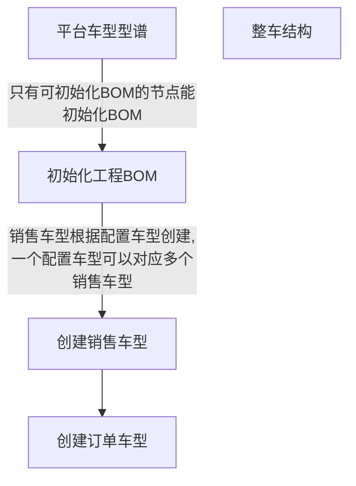

```mermaid
graph TD
A1[平台车型型谱] -->|只有可初始化BOM的节点能初始化BOM| B1[初始化工程BOM]
B1[初始化工程BOM] --> |销售车型根据配置车型创建,一个配置车型可以对应多个销售车型| C1[创建销售车型]
C1[创建销售车型] --> D1[创建订单车型]
A2[整车结构]
```

#### 描述

- 车型结构根据平台车型分类搭建
- 平台车型通过初始化分组功能去新增分组(从整车结构总选择),可以通过删除功能删除指定分组
- 订单车型也可以通过初始化分组功能去新增分组(从整车结构总选择),可以通过删除功能删除指定分组

#### 问题

- 删除分组时，分组下有零件怎么处理
- 数据权限查询时，BOM上记录的分组ID,但没有找到对应分组怎么处理