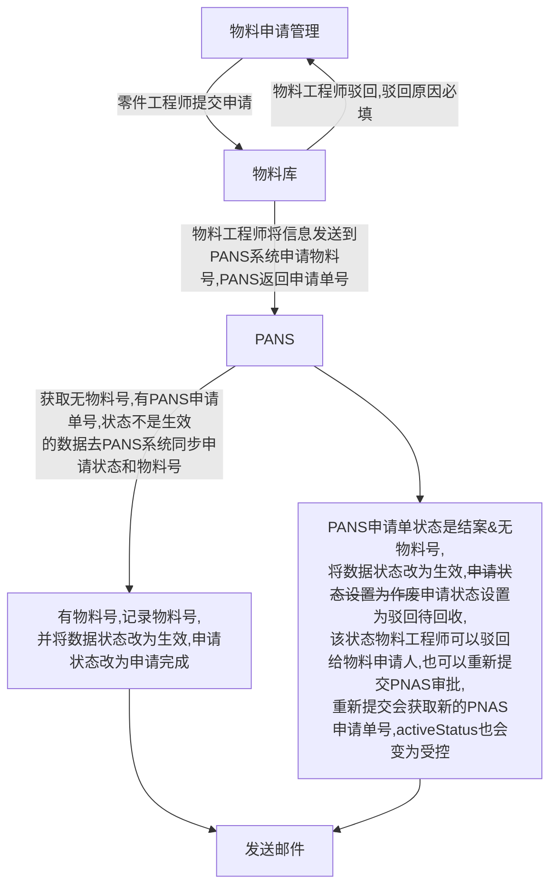

#### 物料申请流程

#### 注意事项

- 物料有一个物料工艺参数维护页面,信息也是记录到custMaterialInfo上的
- 从PNAS同步物料信息时,会用PNAS的数据覆盖BOM的数据,有一些数据是在BOM系统维护的，这些数据不能覆盖(例如物料工艺参数)

#### 主要功能模块

- 物料申请页面(由零件工程师发起)
- 物料库页面(由物料工程师管理，可驳回给零件工程师，也可提交到PNAS)
- 物料工艺参数页面(维护物料的长宽高和一些可以计算物料重量的信息)
- 物料替代库(维护那些物料可以相互替换-区分制造基地)

#### 描述

- 物料会记录版本

- 物料工艺参数有单独的字段记录它是否已经生效,生效后的数据可以修改，修改后自动变成草稿状态，需要重新通过生效按钮生效

- ~~一个零件只能有一个物料号~~

- 一个零件可以有2个物料号(分为内供和外供,每一种供应商可以对应一个物料号)

- 去除供应商来源，制造商代码页面显示成外部供应商和内部供应商

  > 通过codelist修改  制造商   名称
  >
  > 00000 对应外部供应商
  >
  > 66666 对应内部供应商

- 保存或修改时供应商代码不可以重复

- 提交物料库时：校验--1.标准件不能有制造商代码，其它件必须有制造商代码

- 提交PNAS审批时：校验--1.标准件不能有制造商代码，其它件必须有制造商代码

#### 工作记录

- 在零件库页面发起物料申请，会在物料申请页面创建一条申请状态是为申请，提交状态(applyStatus)为未提交的数据(未提交的数据不在物料库中显示)
- 物料申请页面去除撤回提交按钮，在物料库增加驳回按钮，驳回时：
  - 驳回原因必填(未创建和未申请状态的数据可维护)
  - 只能驳回状态为未创建和未申请的数据
  - 驳回后申请状态是-驳回待修订
  - 驳回时发送邮件给物料申请数据的创建人
  - 驳回后在提交时，申请状态变成未申请，驳回原因不清空。申请完成后会清空驳回原因
- 同步物料申请后，自动同步物料的属性
- 物料申请完成后，发送邮件通知
